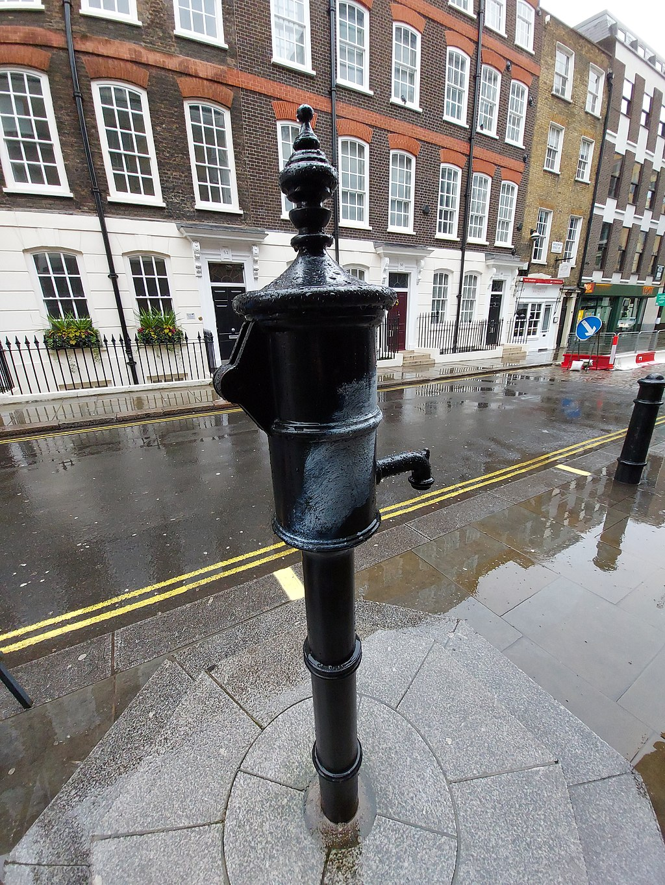
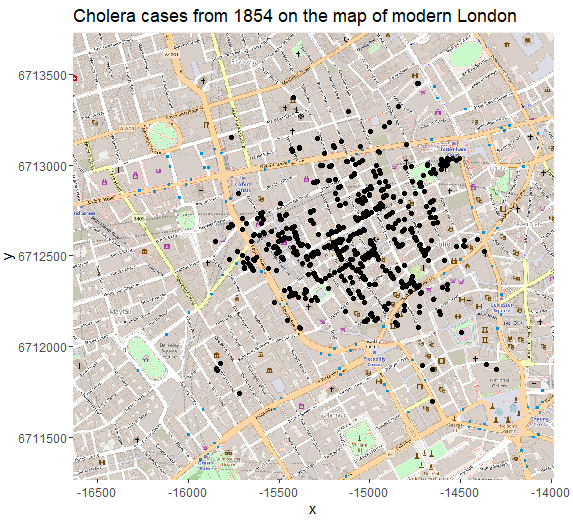
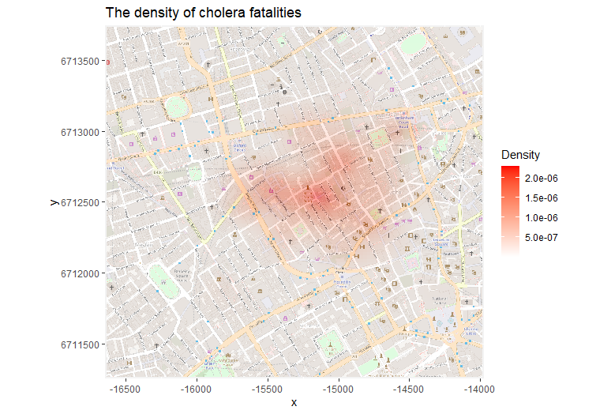

```{r setup, include=FALSE}
knitr::opts_chunk$set(echo = FALSE, warning = FALSE, message = FALSE)
```

## About the session

1. Cholera Outbreak
2. Formats of spatial data
3. Transformations
4. Visualisations
5. Distances
6. Real world maps

## The 1854 Cholera Outbreak in London

<div class="columns-2">
- Killed hundreds of people in the Soho district
- Broad Street and its water pump
- John Snow's investigation $\rightarrow$ modern epidemiology
- Germ-contaminated water versus miasma  

{width=80%}
</div>

## John Snow's original map

{width=55%}

## Data Format

- `library(cholera)` $\rightarrow$ R Studio Cloud
- Location of pumps, roads and fatalities

**Fatalities**
```{r echo = FALSE }
library(cholera)
library(tidyverse)
fatalities[1:10,] 
```


## Pumps
```{r}
pumps 
```

## Roads
```{r}
road.segments %>% select(-street) %>% arrange(name) %>% head(n = 15) 
```

## Transformations

- 1 step $\leftrightarrow$ 100 meters
- Does not generalise 
- Latitude and longitude more universal


**Algorithm for obtaining the latitude and longitude**

1. Find latitude and longitude for Pump 7
2. Research how longitude and latitude correspond to meters at that location
3. Calculate the latitude and longitude for other data points by relating them to Pump 7

```{r echo = FALSE}
pump7 <- pumps[7, ]
pump7["lat"] <- 51.51335
pump7["long"] <- -0.1362
pump7["lat_ref"] <- 0.0008988113669
pump7["long_ref"] <- 0.001440502493


pumps_plt <- pumps %>% mutate(lbl = str_c("Pump ", id)) %>% 
    mutate(lat = pump7$lat + pump7$lat_ref * (y - pump7$y),
           long = pump7$long + pump7$long_ref * (x - pump7$x))

fatal_plt <- fatalities  %>% 
    mutate(lat = pump7$lat + pump7$lat_ref * (y - pump7$y),
           long = pump7$long + pump7$long_ref * (x - pump7$x))

roads_plt <- road.segments  %>% 
    mutate(lat1 = pump7$lat + pump7$lat_ref * (y1 - pump7$y),
           lat2 = pump7$lat + pump7$lat_ref * (y2 - pump7$y),
           long1 = pump7$long + pump7$long_ref * (x1 - pump7$x),
           long2 = pump7$long + pump7$long_ref * (x2 - pump7$x),)
```

## Transformed pumps data

```{r}
pumps_plt %>% select(street, x, y, lat, long)
```

## Visualisations

```{r}
ggplot() +
    geom_segment(data = roads_plt, 
               aes(x = long1, y = lat1, xend = long2, yend = lat2)) + 
    geom_point(data = fatal_plt, aes(x = long, y = lat), size = 1.1) +
    geom_point(data = pumps_plt, aes(x = long, y = lat), 
               col = "red4", fill = "red1", pch = 25, size = 3) +
    geom_label(data = pumps_plt, aes(x = long, y = lat, label = lbl), 
               nudge_y = 0.0007) +
    labs(title = "Fatal cholera cases concentrate around Pump 7") +
    theme_minimal() +
    theme(axis.title.y = element_blank(),
          axis.title.x = element_blank())
```


## ggplot for visualisations
```{r echo = TRUE, eval = FALSE}
ggplot() +
    # Adding layer of roads
    geom_segment(data = roads_plt, 
               aes(x = long1, y = lat1, xend = long2, yend = lat2)) + 
    # Addign layer of fatalities
    geom_point(data = fatal_plt, aes(x = long, y = lat), size = 1.1) +
    # Adding layer of pumps
    geom_point(data = pumps_plt, aes(x = long, y = lat), 
               col = "red4", fill = "red1", pch = 25, size = 3) +
    # Adding labels for pumps
    geom_label(data = pumps_plt, aes(x = long, y = lat, label = lbl), 
               nudge_y = 0.0007) 
```

## Density 

`geom_hex(data = fatal_plt, aes(x = long, y = lat), bins = 13)` 

```{r}
ggplot() +
    geom_hex(data = fatal_plt, aes(x = long, y = lat), bins = 13) + 
    geom_segment(data = roads_plt, 
                 aes(x = long1, y = lat1, xend = long2, yend = lat2)) +
    geom_point(data = pumps_plt, aes(x = long, y = lat), 
               col = "red4", fill = "red1", pch = 25, size = 3) +
    geom_label(data = pumps_plt, aes(x = long, y = lat, label = lbl), 
               nudge_y = 0.0007) +
    labs(title = "The density of fatalities is highest on Broad Street") +
  theme_minimal()  +
    theme(axis.title.y = element_blank(),
          axis.title.x = element_blank())
```

## Distances
```{r include = FALSE}
pump_euclid <- rep(0, nrow(fatalities))
pump_man <- rep(0, nrow(fatalities))

for (i in 1:nrow(fatalities)){
  min_euclid <- Inf
  min_man <- Inf

  for (j in 1:nrow(pumps)){
  dist_euclid <- sqrt((fatalities$x[i] - pumps$x[j])**2 +
                        (fatalities$y[i] - pumps$y[j])**2)
  dist_man <- abs(fatalities$x[i] - pumps$x[j]) + 
    abs(fatalities$y[i] - pumps$y[j])
  if (dist_euclid < min_euclid){
    min_euclid <- dist_euclid
    pump_euclid_id <- pumps$id[j]
  }
  if (dist_man < min_man){
    min_man <- dist_man
    pump_man_id <- pumps$id[j]
  }
  }
  pump_euclid[i] <- pump_euclid_id
  pump_man[i] <- pump_man_id
  
}

fatal_plt["closest_euclid"] <- as.factor(ifelse(pump_euclid %in% c(6, 7, 8, 9, 10), pump_euclid, 0)) 
fatal_plt["closest_man"] <- as.factor(ifelse(pump_man %in% c(6, 7, 8, 9, 10), pump_man, 0))

plt_euclid <- ggplot() + 
  geom_point(data = fatal_plt, aes(x = long, y = lat, color = closest_euclid),
             size = 1.5) +
  geom_segment(data = roads_plt, 
               aes(x = long1, y = lat1, xend = long2, yend = lat2)) +
  geom_point(data = pumps_plt, aes(x = long, y = lat), col = "red4", pch = 25, 
             size = 3, fill = "red1") +
  geom_label(data = pumps_plt, aes(x = long, y = lat, label = lbl), 
             nudge_y = 0.0007) + 
  labs(title = "Pump 7 was the closest pump for the majority of cholera cases",
       color = "Closest Pump") +
  theme_minimal() +
  theme(axis.title.y = element_blank(),
        axis.title.x = element_blank()) + 
  scale_color_discrete(labels = c("Other", "Pump 6", "Pump 7", "Pump 8",
                                 "Pump 9", "Pump 10"))
```


```{r}
plt_euclid
```

## Distance Metrics - Euclidean Distance

$$ \sqrt{(x_1 - x_2)^2 + (y_1 - y_2)^2} $$

```{r}
df222 <- tibble(x = fatal_plt$long[222], y = fatal_plt$lat[222],
                xend = pumps_plt$long[7], yend = pumps_plt$lat[7])
plt_euclid + geom_segment(data = df222, 
                          aes(x = x, y = y, xend = xend, yend = yend),
                          arrow = arrow(length = unit(1, "cm")), size = 2) +
    labs(title = "Euclidean distance represents the most direct route") +
    theme(legend.position = "none",
          axis.text = element_blank())
```

## Distance Metrics - Manhattan Distance

$$ |x_1 - x_2| + |y_1 - y_2| $$
```{r}
plt_euclid + 
    geom_segment(data = df222, 
                aes(x = x, y = y, xend = xend, yend = y),
                arrow = arrow(length = unit(1, "cm")), size = 2) +
    geom_segment(data = df222, 
                aes(x = xend, y = y, xend = xend, yend = yend),
                arrow = arrow(length = unit(1, "cm")), size = 2) +
    labs(title = "Manhattan distance is appropriate for cities with a grid layout") +
    theme(legend.position = "none", 
          axis.text = element_blank())
```

## ggplot for grouping and arrows

```{r eval = FALSE, echo = TRUE}
df222 <- tibble(x = fatal_plt$long[222], y = fatal_plt$lat[222],
                xend = pumps_plt$long[7], yend = pumps_plt$lat[7])

ggplot() + 
  # Colour by closest pump
  geom_point(data = fatal_plt, 
             aes(x = long, y = lat, colour = closest_euclid)) +
  geom_segment(data = roads_plt, 
               aes(x = long1, y = lat1, xend = long2, yend = lat2)) +
  geom_point(data = pumps_plt, aes(x = long, y = lat), 
             col = "red4", fill = "red1", pch = 25, size = 3) +
  # Add arrows with the arrow argument
  geom_segment(data = df222, 
                aes(x = x, y = y, xend = xend, yend = yend),
                arrow = arrow(length = unit(1, "cm")), size = 2)
```

## Is Pump 7 the cause for the outbreak?

```{r}
fatal_plt %>% 
  pivot_longer(cols = c(closest_euclid, closest_man), names_to = "metric",
               values_to = "pump_id") %>% 
  group_by(metric, pump_id) %>% count() %>% 
  pivot_wider(names_from = metric, values_from = n) %>% 
  mutate(euclid_perc = round(closest_euclid / nrow(fatalities), 2),
         man_perc = round(closest_man / nrow(fatalities), 2))
```

Requires further analysis.

## Real World Maps

<div class="columns-2">
- the `OpenStreetMap` library
- the Mercator projection
- could include cycle routes, public transport, land relief

{width=100%}
</div>

## Smooth density 



## Further Resources

- Cholera package (functions for walking distances):
https://github.com/lindbrook/cholera

- Example of using tif and shp files:
http://rstudio-pubs-static.s3.amazonaws.com/4978_ae448a4622ed437f8619c29a16acf2a9.html

- Correspondance of meters to degrees in latitude and longitude
http://www.csgnetwork.com/degreelenllavcalc.html

- Github and R Studio Cloud for this workshop:
https://rstudio.cloud/spaces/128705/join?access_code=zYU0kUP39y3F2ioQg8%2FfERydxg82JIH3YsuhCWhn
https://github.com/warwickdatasciencesociety/geospatial-workshop

